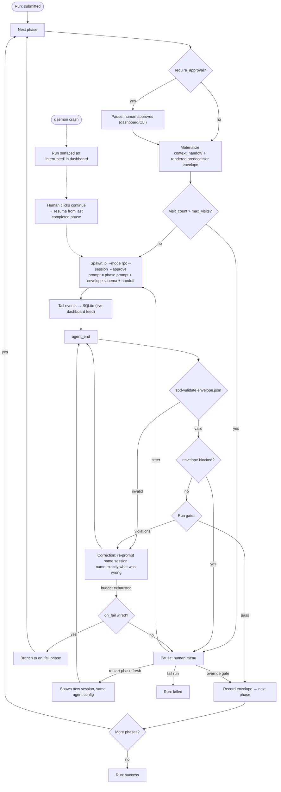

# Showrunner — Plan

> **Status**: design settled through a grilling session. Implementation not started.
> **Spine**: `CONTEXT.md` (glossary) · `docs/adr/0001`, `0002` (architecture decisions) · `docs/diagrams/run-loop.md` (run lifecycle)

## 1 · What Showrunner is

Showrunner is an agent orchestration tool: you write **blueprints** — plays of **phases**, each running a configured **agent** against a local pi harness — and Showrunner executes them, records everything into SQLite for a live dashboard, and **corrects or pauses** agents based on typed **envelopes** and **gates**.

Three tenets shape every part of it:

- **Observable** — every event lands in SQLite mid-flight; runs are watched while they happen, not read about afterwards. If you cannot measure your agents, you cannot improve them.
- **Customizable** — agents and blueprints are typed code; the fix for anything is a small edit in an obvious file.
- **Reusable** — the SDK is framework-agnostic; no part of the system is locked into another; the starter content ships to be replaced, not kept.

Vibe coding is not knowing how your system works, and not looking. Agentic engineering is knowing how your system works so well that you do not have to look.

## 2 · Vocabulary

Full glossary in `CONTEXT.md`. The load-bearing distinctions:

- **Run** — one execution of a blueprint (the entity the dashboard lists; the schema's top-level table, named `runs` — "session" is reserved for pi).
- **Agent Session** — one pi invocation of one agent within a phase, keyed by a pi session id that can be continued.
- **Envelope** — the typed JSON output of one agent invocation: a flexible base extended by a zod schema the *phase* declares. Whether the work succeeded is determined by the gates, never by the agent's claim.
- **Correction** — the harness re-prompts the *same* agent session, naming exactly what was wrong. Nothing restarts; a correction costs one message.
- **Steering** — human intervention in a live agent session (pi rpc `steer`), delivered between the agent's turns.
- **Visit** — one execution of a phase within a run. Corrections happen inside a visit; the loop guard counts visits, not corrections.
- **context_handoff** — the filesystem channel between phases: the reference files agents write (outputs) and the inputs the harness materializes for them (the automatic handoff).

## 3 · Architecture

### 3.1 Process topology

- A long-lived **daemon** owns execution: it spawns pi agents, tails their JSONL output, owns the SQLite write path, and tracks child PIDs (the `processes` table) so a stuck run can be found and stopped.
- The **CLI** (`showrunner run <blueprint>`) and **pi skill files** submit runs to the daemon. Most runs are started this way.
- The **dashboard** is read-only plus control verbs (steer / approve / override / resume / fail). It does not spawn runs in v1.
- Concurrency: a configurable pool, default ~2 concurrent runs. Unbounded parallelism would make cost control impossible.
- Agents run as `pi --mode rpc --session <id> --approve`: one channel carries the JSONL event stream (the tracer) *and* the `steer` verb (human intervention).

### 3.2 Repo layout

Single repo, `packages/*` folders. No pnpm/nx/turbo layer; bun workspaces only if `core` ever needs standalone publishing (deferred).

```
packages/core         SDK: blueprint/agent/envelope/gate/run/event types + the run loop.
                      No pi or UI dependencies — the reusable, strongly typed heart.
packages/daemon       spawns pi (rpc mode), tails events, owns SQLite, serves the API
packages/cli          submit + watch runs, steer
packages/ui           Remix@next dashboard
packages/starter-kit  six agents, skill blueprints, shared gates, the polling tool
```

### 3.3 Data path

```
agents -> JSONL (pi --mode rpc) -> tracer tails stdout -> SQLite (WAL) -> readers (sqlite3, tail, poll, UI)
```

- **WAL** so readers never block the running writers.
- **One cursor query is the entire read transport**:
  `select * from events where run_id = ? and rowid > ? order by rowid limit 500;`
  Live view and full history are the same query at different cadence. No ingest endpoint, no WebSocket, no backfill, no separate replay path.
- **Seven tables**: `runs`, `phases`, `events`, `envelopes`, `gate_results`, `agent_sessions`, `processes` (id → pid).
- **Ten harness event types** (final enumeration at implementation): run/phase lifecycle, agent lifecycle, tool calls, envelopes, gate results, corrections, human actions, spend.
- **Tool-call folding**: pi announces one tool call across three raw events (`tool_execution_start` / `tool_execution_update` / `tool_execution_end`). The tracer folds them into exactly one `tool_call` row per real call, named the way you'd read it aloud (`bash: ls -la src`), carrying `{tool, tool_call_id, args, result_snippet, ok, duration_ms, agent}`.
- **Files stay the raw record**: `raw_output.jsonl`, `envelope.json`, `agent_map.json`. The DB is the queryable mirror; losing it loses nothing you cannot rebuild.

### 3.4 Daemon API

- **Read**: `list-runs`, `run-detail`, `events-cursor` (the one query), `envelopes`, `gate-results`, `spend`.
- **Control**: `submit-run`, `resume-run`, `fail-run`, `steer-session`, `approve-phase`, `override-gate`, `restart-phase-fresh`.

## 4 · The run loop



Every loop terminates through either a budget (corrections), a guard (`max_visits`), a human (pause menu), or the crash path (manual continue). Nothing restarts on its own; nothing loops forever by accident.

## 5 · Core shapes

```ts
// envelope — the base, extended per phase (ADR-0002)
export const EnvelopeBase = z.object({
  summary: z.string(),
  artifacts: z.array(z.string()),          // paths in context_handoff/<phase>/outputs
  notes_for_next_agent: z.string(),
  blocked: z.boolean().optional(),         // agent asserts it cannot proceed
  blocked_reason: z.string().optional(),   // shown on the pause screen
});

// agent — a pure doer, no output contract of its own (ADR-0001)
defineAgent({
  name: string,
  model: string,                           // from the replaceable model roster
  prompt: string,
  tools: string[],                         // bash, edit, read, grep, find, poll...
  context: string[],                       // literal content or exact filepaths (§8)
});

// gate — plain function, first-class (ADR-0001)
type Gate = (envelope, ctx) => Promise<{ pass: true } | { pass: false; violations: string[] }>;

// blueprint — phases reference imported agents/gates directly, no string registries
defineBlueprint({
  name: string,
  phases: [{
    agent,                                // imported module
    envelope,                             // zod schema, extended from EnvelopeBase
    gate?,                                // Gate | Gate[]
    budget?,                              // max corrections per visit (default ~3)
    on_fail?: { to: phase },              // fired after budget exhaustion — loops by config
    require_approval?: boolean,           // pause for human before start
    context?: string[],                   // phase-level additions to the agent's defaults
  }],
  onPhaseStart?, onPhaseEnd?,             // TS callbacks + ctx.shell() (§11)
});
```

## 6 · Settled decisions, with rationale

1. **Daemon topology** — one long-lived owner of execution. Matches the `processes` table; enables crash-surfacing and the control verbs. (ADR candidate)
2. **Blueprints and agents are code, not data** — type-checked correctness, shared logic importable, one language and one validation story. Supersedes the original "one YAML file" spec. *(ADR-0001)*
3. **The envelope contract belongs to the phase** — an agent with its own envelope stops being reusable. The phase declares the zod schema; the daemon renders it into the agent's prompt. *(ADR-0002)*
4. **No `status` on the envelope; `blocked` instead** — outcome is determined by parse + gates, never by the agent's claim. `blocked` is the one agent-asserted signal: it short-circuits to the human pause *before* gates, burning no corrections.
5. **Corrections in place; nothing restarts** — pi's `--session` is create-or-continue, so re-prompting the same session is one message and the context window stays intact. A cold restart throws away everything the agent learned.
6. **Budgets and a loop guard** — per-phase max corrections; per-phase `max_visits` (default ~3) bounds cross-phase cycles. Exhaustion → `on_fail` or pause. Loops terminate or a human decides.
7. **Control flow is linear + `on_fail` pointers** — loops are wiring, not syntax; no parallelism in v1.
8. **Context is an array of strings** — each entry is literal content or an exact filepath; the harness reads files in at runtime and inlines everything into the prompt. Briefing, not bulk.
9. **Zero-friction handoff** — the next phase's agent never works to get the information it needs: the predecessor's `envelope.json` + its artifacts are always available, no declaration required.
10. **Human intervention menu** — steer (into the same session), override gate, restart phase fresh, fail run.
11. **Trust: default `--approve`, opt-in approval** — phases can declare `require_approval` (e.g. `ship`); the run pauses and the human approves. This is the one place "success must be earned" includes a human.
12. **Cost telemetry in v1; caps deferred** — per-run and per-phase spend from pi's `usage` events × a local, replaceable model→price roster.
13. **Hooks** — TS callbacks (`onPhaseStart`/`onPhaseEnd`) with a `shell()` helper for subprocess one-liners.
14. **Waits are tools, not harness features** — the starter toolset ships a polling tool with its own timeout; the agent decides when to wait, and the gantt shows it as an ordinary long tool call.
15. **Crash = surface, not auto-resume** — interrupted runs appear in the dashboard; a human clicks **continue**; the daemon resumes from the last completed phase (pi session files persist, so continuation is real).
16. **Tests: fixtures + smokes** — a `FakePi` replays scripted JSONL event streams (deterministic, CI-safe) plus a few env-gated real-agent smoke tests against a tiny repo.

## 7 · Control flow semantics

- **Correction** ≠ **Visit**. A correction is a re-prompt within a visit (cheap, same session). A visit is a phase execution. The gantt shows both counts per phase; the budget bounds corrections, the guard bounds visits.
- **`on_fail` timing**: fires only after the phase's correction budget is exhausted — corrections are the cheap first response, a phase change is the escalation. With no `on_fail`, exhaustion pauses.
- **`blocked`** — pre-gate, always pauses; never routed through `on_fail` (a blocked agent means human judgment, not another automatic branch).
- **Terminal states**: `success`, `failed`, `paused`, `interrupted` (crash, awaiting human continue).

## 8 · Context & handoff

- **The rule**: at spawn, the harness walks each `context` entry — resolve against the run's cwd (fallback: the agent module's dir); if it resolves to a readable file, read and inline its contents; otherwise treat the string as literal content. Exact paths only; no globs.
- **The automatic handoff**: the predecessor's `envelope.json` and every artifact it listed are always materialized for the next phase. This is "context transfers in code, not in conversation."
- **Two directions, one channel**: `context_handoff/<phase>/inputs/` (what the harness gives) and `context_handoff/<phase>/outputs/` (what the agent writes and lists in `artifacts`). Outputs become the next phase's inputs.
- **Zero-friction**: the phase prompt explicitly names the handoff and context; the agent never hunts.

## 9 · Human intervention & trust

- Pause menu (any pause): **steer** a corrective instruction into the same session (pi rpc `steer`, delivered between turns) · **override** the gate (recorded, audited) · **restart phase fresh** (new session, same config) · **fail the run**.
- **Approval**: `require_approval` phases pause before starting (dashboard/CLI). Recorded as an event; the audit trail is the point of having an override at all.

## 10 · Observability & cost

- Every event lands in SQLite while the agent is still typing — tool calls visible mid-run, not batched at the end.
- **Gantt** (per phase): duration, corrections, visits, spend.
- **Phase drill-in**: the agent configuration used, prompt, token usage, envelope, gate results, and a simplified output feed "as though we were viewing it in the TUI."
- **Spend**: per-run and per-phase, from pi `usage` × local price roster. Estimates until a source of truth exists.

## 11 · Hooks & waits

- Hooks: `onPhaseStart(ctx)` / `onPhaseEnd(ctx)` in the blueprint module; `ctx.shell()` for git/install one-liners.
- Waits: a `poll`/`wait_for` tool with its own timeout, used by agents (e.g. `ship` watching CI). The harness does not manage external waits; it just observes the long tool call.

## 12 · Crash & recovery

- Daemon crash → in-flight pi processes orphan; the `processes` table is how they're found. Runs surface as **interrupted** in the dashboard.
- Human clicks **continue** → the daemon resumes from the last completed phase; the interrupted phase's pi session is relaunched with `--session <id>` and a continue instruction.
- Mid-tool-call deaths can leave a half-committed transcript — resumed runs are flagged for a human glance. No auto-resume in v1.

## 13 · Test strategy

- **`FakePi`** — replays scripted JSONL event streams (retry, gate-fail, blocked, crash scenarios) against the daemon/tracer/gates/DB/resume paths. Deterministic, CI-safe, no tokens.
- **Real smokes** — env-gated, opt-in: `plan → build` on a tiny repo proving the pi wiring actually works.
- Fixtures are the test surface for the hard parts; smokes are the "the tests it ships are not your tests" starter surface.

## 14 · Starter kit

Six agents, each a typed module (prompt, model, tools, default context) — purpose-built doers:

| Agent        | Job                                                             |
| ------------ | --------------------------------------------------------------- |
| `planner`    | concrete plan documents for other agents; iteratively implements a plan and raises questions |
| `builder`    | implements a plan                                               |
| `scout`      | read-only recon: what files are involved, a base of information |
| `reviewer`   | reviews plans or builder output for correctness against the plan |
| `documenter` | clear, readable docs for agents and humans alike                |
| `ship`       | commit, create PR, observe CI (polling tool), loop back         |

Skills shipped in the box (pi skill files wrapping blueprints):

| Skill                  | Blueprint                                   | Reach for it when |
| ---------------------- | ------------------------------------------- | ----------------- |
| `prompt` {prompt}      | user prompt to \<agent\>                    | one agent, one prompt, `NAME` picks who |
| `scout` {prompt}       | user prompt to scout                        | read-only recon, nothing changes |
| `plan` {prompt}        | user prompt to planner                      | the spec before any code |
| `build` {prompt}       | user prompt to builder                      | the plan already exists |
| `plan_build` {prompt}  | planner, builder, ship                      | small, well-understood work |
| `build_test` {prompt}  | builder, gate(test, lint), bounded fix loop | a suite to satisfy |
| `build_review` {prompt}| builder, reviewer, bounded revise loop      | "is this what was asked for" matters more than "does it run" |
| `plan_build_test` {p}  | plan, build, gate(test, lint), review, ship | the standard chain |
| `document` {prompt}    | user prompt \| git diff, documenter         | write up what just shipped |
| `everything` {prompt}  | plan, build, test, review, ship             | the work is real and its shape is not obvious |

Shared gates library: `testsPass`, `lintClean`, `matchesPlan`, `envelopeShape`, … plus the `poll` tool.

**The replace-this doctrine**: the tests it ships are not your tests; the prompts describe a demo app, not your domain; the roster names the models that were good the week it was written. All of it is meant to be replaced by a small edit in an obvious file. That is what observable / customizable / reusable are *for*.

## 15 · UI (Remix@next)

- **Run list** — every run and its status (`success` / `failed` / `paused` / `interrupted` / running), with spend.
- **Run detail** — a gantt-style view of phases: completed, in-flight, how long each took, how many corrections and visits, spend per phase.
- **Phase drill-in** — agent config, prompt, token usage, envelope, gate results, simplified output feed.
- **Controls** — the pause menu: steer / override / restart / fail; approve; resume interrupted runs. Read-only otherwise.

## 16 · Deferred

- Cost *caps* (per-run and global) — telemetry first.
- Auto-resume after daemon crash — manual continue first.
- Publishing `core` standalone.
- Model→price roster auto-update.
- Parallel phases; branching beyond `on_fail`.

## 17 · Implementation order

1. **`packages/core`** — zod types (`EnvelopeBase`, agent, blueprint, gate, run/event), the run-loop skeleton, `FakePi` test harness + first fixture tests. No pi dependency.
2. **`packages/daemon`** — SQLite schema (7 tables, cursor query), spawn/tail pi (rpc mode), tracer with tool-call folding, envelope/gate runner, corrections, pause menu, resume.
3. **`packages/cli`** — submit, watch, steer.
4. **`packages/ui`** — Remix@next: run list → gantt → phase drill-in → controls.
5. **`packages/starter-kit`** — six agents, gates library, polling tool, skill files.
6. Update docs (ADR-0003 candidates: daemon topology; context-as-strings) as decisions harden in code.

## 18 · Edge cases & open questions

- **Mid-tool-call crash** — half-committed transcript; resumed runs carry a `needs_review` flag.
- **Literal-vs-path collision** — a literal context string that matches a real filepath gets read as a file; no escape syntax until something needs it.
- **Price roster** — local config, estimates; values are replaceable by design.
- **Token usage** — from pi `usage` in the event stream; aggregation is per message/turn → phase/run.
- **Name collision** — "Showrunner" is used by Fable's AI TV platform; accepted, and a rename is a one-line config change.
- **`on_fail` + loop guard** — the guard counts every visit, so cycles (reviewer → builder → reviewer) always terminate or pause.
