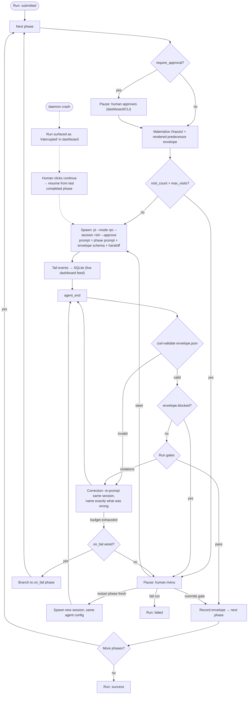

# Run loop — Showrunner

```mermaid
flowchart TD
    Start(["Run: submitted"]) --> Next["Next phase"]
    Next --> Appr{"require_approval?"}
    Appr -- "no" --> Mat
    Appr -- "yes" --> WaitAppr["Pause: human approves (dashboard/CLI)"]
    WaitAppr --> Mat
    Mat["Materialize <run_id>/<phase>/inputs/ + rendered predecessor envelope"] --> Vis{"visit_count > max_visits?"}
    Vis -- "no" --> Spawn["Spawn: pi --mode rpc --session &lt;id&gt; --approve<br/>prompt = phase prompt + envelope schema + handoff"]
    Vis -- "yes" --> Pause
    Spawn --> Tail["Tail events → SQLite (live dashboard feed)"]
    Tail --> End["agent_end"]
    End --> Parse{"zod-validate envelope.json"}
    Parse -- "invalid" --> Corr["Correction: re-prompt same session,<br/>name exactly what was wrong"]
    Corr --> End
    Parse -- "valid" --> Blocked{"envelope.blocked?"}
    Blocked -- "no" --> Gates{"Run gates"}
    Blocked -- "yes" --> Pause
    Gates -- "violations" --> Corr
    Gates -- "pass" --> Record["Record envelope → next phase"]
    Record --> More{"More phases?"}
    More -- "yes" --> Next
    More -- "no" --> Done["Run: success"]
    Corr -- "budget exhausted" --> FailW{"on_fail wired?"}
    FailW -- "yes" --> Branch["Branch to on_fail phase"] --> Next
    FailW -- "no" --> Pause["Pause: human menu"]
    Pause -- "steer" --> Spawn
    Pause -- "override gate" --> Record
    Pause -- "restart phase fresh" --> Fresh["Spawn new session, same agent config"] --> End
    Pause -- "fail run" --> Failed["Run: failed"]
    Crash(["daemon crash"]) -.-> Surf["Run surfaced as 'interrupted' in dashboard"]
    Surf -.-> Resume["Human clicks continue<br/>→ resume from last completed phase"]
    Resume -.-> Spawn
```
