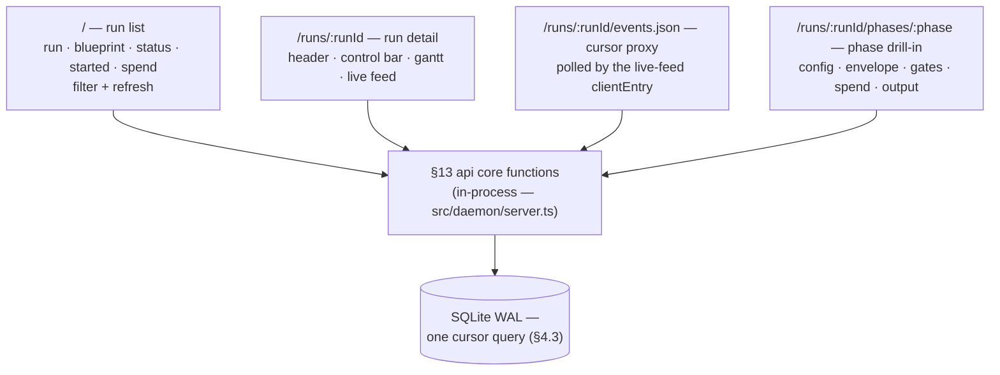
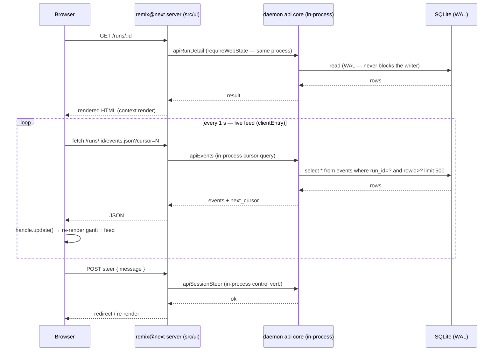

# Showrunner — Specification · UI — the remix@next dashboard

> Part of the [Showrunner specification](README.md) — section §16.
> **⚠️ NOT a React project** — see §16.1; read the mandatory guide list in §16.2 before touching `src/ui`.
> [index](README.md) · [01-overview](01-overview.md) · [02-core](02-core-sdk.md) · [03-data](03-data-and-events.md) · [04-daemon](04-daemon.md) · [05-ui](05-ui-dashboard.md) · [06-starter](06-starter-kit.md) · [07-tests](07-testing-and-rollout.md) · [08-verify](08-verification-record.md)

## 16 · UI (remix@next) — the dashboard

### 16.1 NOT a React project

The dashboard is built on **`remix@next`** (the `remix` package, v3 — `next` dist-tag): a ground-up, full-stack TypeScript framework that **does not use React at all**. This is a settled decision, not an open question, and it is stated this strongly because past agents repeatedly assumed React and produced wrong code. Everything in §16 assumes remix@next's model — if you find yourself writing React, you are wrong:

- **No React runtime** — `remix` is the *only* runtime dependency in `package.json`; there is no `react`/`react-dom` anywhere (verified against the official start-here guide).
- **No react-router** — routing is `remix/routes` typed route maps.
- **No React component idioms** — components use a different model: a function that receives a `handle` and returns another function that renders JSX (setup phase runs once; the returned render function runs on every update). State is a plain variable in the setup scope; updates via `handle.update()`.
- **Nothing from the React ecosystem belongs here**: no components library, no hooks, no context API, no `useEffect`, no JSX-the-React-way, no styling library — the `remix` package ships its own equivalents (§16.3).
- React Router v7 (framework mode) is **explicitly not** the target; that path serves Remix-v2-style apps and is not this project.

Why the React-free choice matters for Showrunner:

- The Reusable tenet ("no part of the system is locked into another") is violated by dragging a React runtime into the dashboard; remix@next has none by construction.
- "Agent-First Development" is one of remix@next's six core principles — it optimizes source, docs, tooling, and abstractions for LLM agents, which is Showrunner's own audience (and consistent with PLAN's agentic-engineering ethos).
- "Religiously Runtime" + bundlerless, source-served assets: the UI is ordinary typed code that agents and humans read and edit — the replace-this doctrine applies to the dashboard too.
- Web APIs (`Request`/`Response`/`FormData`) as the seam with the daemon: the same portability story as the framework-agnostic core.

### 16.2 You MUST read the remix@next docs first

Before writing or reviewing any `src/ui` code, read the official guides at **https://guides.remix.run** — they are the primary source for everything in §16.3 onward and are structured for exactly this kind of agent-led work. Read the whole path once, then re-read the chapter relevant to the task at hand:

1. **start-here** — the tour: single-package app, route map, controller, render, hydration
2. **request-handling** — runtime adapters, `createRequestListener`, middleware ordering, typed request context
3. **routing-and-controllers** — route maps, route builders, controllers
4. **rendering-ui** — the two-phase component model
5. **streaming-ui-with-frames** — the render middleware behind `context.render(...)`
6. **data-and-validation** — `remix/data-schema`
7. **files-and-assets** — bundlerless asset serving, `clientEntry`, colocated `public/`
8. **interactivity** — client entries, events, progressive enhancement

Do not implement §16.3 onward from memory of Remix v2 or from this document alone — verify against the guides. (The §16 facts in this spec were checked against `/start-here`.)

### 16.3 What remix@next provides — the entire web stack

remix@next is not "React plus libraries"; for this app it *is* the whole web side. "For most web apps, `remix` can be the only runtime dependency in `package.json`" (official guide). It provides:

- **Typed routing and middleware** — `remix/routes` (route maps, `get`/`form` helpers, typed `href` builders), `remix/router` (`createRouter`), `remix/middleware/*` (static, form-data, render, …)
- **UI component model with server rendering and browser hydration** — `remix/ui` (`Handle`, `clientEntry`), `context.render()`; components render server-side and stream as HTML, then hydrate on demand
- **Navigation and forms** — typed links, redirects, and form `GET`/`POST` routes derived from the route map
- **Styling and event primitives** — `css()`/`mix` props and `on(...)` listeners — no styling library or event system to add
- **Data validation and persistence** — `remix/data-schema` (+ `form-data`, `coerce` subpaths): the framework's own validator
- **Authentication and sessions** (available if ever needed)
- **Asset serving** — bundlerless: browser modules are served as source from colocated `public/` directories via `import.meta.url`
- **Testing** — framework-provided test surface

Consequence for this project: `src/ui`'s dependency list is essentially just `remix` plus the daemon's §13 api core (called in-process — not a network client). There is no router choice, no UI-library choice, no styling choice, no form/validation-library choice to make — the framework owns all of it, which is exactly what the Reusable tenet wants.

### 16.4 Information architecture

The dashboard is three pages plus one JSON proxy route. Every page renders server-side and talks to the daemon **server-side**; the browser only ever sees HTML and polls the proxy (§16.5).



| page | route | renders | data source (§13 api core, in-process) |
|---|---|---|---|
| Run list | `/` | table of runs | `apiListRuns` (`/api/runs`) |
| Run detail | `/runs/:runId` | header + control bar + gantt + live feed | `apiRunDetail` + `apiEvents` (`/api/runs/:id` + `/events?cursor=`, polled) |
| Events proxy | `/runs/:runId/events.json` | JSON for the feed's clientEntry | `apiEvents` — a direct **in-process** call, no HTTP round trip |
| Phase drill-in | `/runs/:id/phases/:phase` | config, envelope, gates, spend, output | `apiPhaseEnvelopes`, `apiPhaseGates`, `apiSpend`, `apiRaw` |

### 16.5 Data flow & live updates

Two flows: page load (server-side) and the live loop (hydrated component polling the cursor proxy). No WebSocket, no ingest path — the one cursor query (§4.3) is the only read transport, exactly as §2.3 mandates. The dashboard's server-side actions call the daemon's §13 api core functions **in-process** (`app/lib/daemon.ts` → `requireWebState()` → `src/daemon/server.ts`) — the same process, no socket round trip, no `DaemonClient` in the UI.



- Poll cadence: 1 s per open run detail page. The clientEntry keeps `next_cursor` in the setup scope and passes it back — same query, sliding window, zero server state.
- The gantt's in-flight fill and duration are recomputed from `phase_start`/`phase_end`/`agent_*` events in the same poll, so the gantt and the feed are always one snapshot.
- SSE over the same proxy remains the escape hatch if 1 s polling ever feels laggy — still no new transport.

### 16.6 Run list page (`/`)

```
┌────────────────────────────────────────────────────────────────┐
│ Showrunner  ·  runs                    [refresh]  status: all ▾ │
├────────────────────────────────────────────────────────────────┤
│  RUN        BLUEPRINT     STATUS        STARTED      SPEND     │
│  a1f2f3     plan_build    ▶ running     14:02:11     $0.42     │
│  b3c4d5     build_test    ⏸ paused      13:58:20     $1.10     │
│  c5d6e7     everything    ✓ success     13:41:09     $3.82     │
│  d7e8f9     prompt        ✗ failed      13:12:44     $0.31     │
│  e9f0a1     scout         ⚠ interrupted 12:50:03     $0.08     │
│  f1a2b3     plan_build    ⏳ queued (2)  12:41:55     -         │
└────────────────────────────────────────────────────────────────┘
```

- Rows link to run detail. Status uses the shared `StatusPill` (§16.10): running = animated pulse, paused = amber, success = green, failed = red, interrupted = grey ⚠, queued = dim with queue position.
- Sort: started desc. Filter: by status (v1). `refresh` re-fetches `GET /runs` server-side.
- Empty state (§16.10): "no runs yet — `showrunner run <blueprint>`".

### 16.7 Run detail page (`/runs/:runId`) — gantt + live feed

```
┌──────────────────────────────────────────────────────────────────┐
│ ◀ runs   plan_build · a1f2f3            ▶ running      [fail]    │
│ cwd ~/src/tiny-repo · started 14:02:11 · spend $0.42            │
├──────────────────────────────────────────────────────────────────┤
│  PHASE    AGENT      STATUS      DURATION   CORR VIS  SPEND     │
│  plan     planner    ████████████ 12:04      0   1    $0.12     │
│  build    builder    ██████░░░░░░  08:31      2   1    $0.30  ◀ │
│  ship     ship       ░░░░░░░░░░░░  pending    -   -    -        │
│                     ↑ now (vertical cursor)                      │
├──────────────────────────────────────────────────────────────────┤
│  LIVE FEED                                      [auto-scroll ●] │
│  ▶ tool  14:10:22  bash: npm test -- --run          ✓  4.2s     │
│  ▶ turn  14:10:18  assistant: running the test suite             │
│  ⚠ corr  14:10:15  "tests failed: expected 3, got 2 — fix t1"   │
│  ✗ gate  14:09:38  lintClean · violations: 1                     │
│  ▶ tool  14:09:30  bash: ls -la src                 ✓  0.1s     │
└──────────────────────────────────────────────────────────────────┘
```

**Header**: blueprint name, run id, `StatusPill`, cwd, started/ended, total spend, `needs_review` badge (amber ⚠ if set — §16.10). Control bar: `fail` (confirm), `resume` (only when `interrupted` or `paused`), and the pause menu trigger (only when `paused`, §16.9).

**Gantt** (the `Gantt` component):

- One row per phase, in blueprint order. Columns: phase name, agent, status, duration, corrections (CORR), visits (VIS), spend.
- Bar fill = fraction of the phase's elapsed time against the run's timeline; completed phases are fully filled in their status color; the in-flight phase fills live from poll data; pending phases are empty (dimmed).
- A vertical **now** cursor sits at the current run-relative time while the run is running.
- Correction marks: a small `✖n` on the bar; click a row → phase drill-in.
- Paused phases show ⏸ and the amber fill edge.

**Live feed** (the `EventFeed` component):

- Renders folded daemon events (types 1–12, §6) newest-last; each row is typed by the `EventRow` component (§16.10): tool calls as `bash: npm test` with expandable args + result snippet, turns as assistant messages, corrections ⚠ with the message, gate results ✗/✓ with violations, `human_action` (steer/override/…) with a distinct marker, spend deltas.
- Auto-scroll to newest by default; pause on hover; toggleable.
- This is the "as though we were viewing it in the TUI" surface — the observable tenet made literal.

### 16.8 Phase drill-in page (`/runs/:id/phases/:phase`)

Stacked cards (tabs deferred — v1 keeps it linear):

```
┌────────────────────────────────────────────────────────────────┐
│ ◀ runs › plan_build › build        build · visit 1 · corr 2    │
├────────────────────────────────────────────────────────────────┤
│ CONFIG — agent: builder · model: deepseek-v4-pro               │
│   tools: bash, edit, read, grep, find, poll                    │
│   context: README.md (inlined) · "demo repo rules"            │
│   prompt: [pre block — from the blueprint snapshot §13.3]      │
│                                                                │
│ ENVELOPE — accepted 14:10:41 (attempt 2 of 3)                  │
│   attempts: 1 ✗ invalid (envelope.json missing) → corrected    │
│             2 ✓ valid, gates passed                            │
│   [view JSON] [view envelope.json path]                        │
│                                                                │
│ GATES — testsPass ✓ · lintClean ✗ (1 violation)                │
│   [override] (records reason + who — audited, §13.2)           │
│                                                                │
│ SPEND — tokens in 12,480 · out 3,210 · cache r/w 0/0 · $0.30   │
│                                                                │
│ OUTPUT — raw feed tail (raw_output.jsonl)                    │
└────────────────────────────────────────────────────────────────┘
```

- **Config**: from the run's blueprint snapshot (§13.3), not the live blueprint — what actually ran.
- **Envelope**: accepted envelope + full attempt history (each attempt: valid/invalid, violations, and the correction message that followed).
- **Gates**: per gate — pass/fail, violations list, `overridden` badge with reason + who (the audit trail is the point, §13.2).
- **Spend**: per-phase tokens (in/out/cache) and USD from `spend` events.
- **Output**: tail of `raw_output.jsonl` (the record of truth, §10), simplified — the drill-in's "TUI-like" view.

### 16.9 Pause menu & control verbs

A modal rendered by run detail when the run is `paused` (and by drill-in when the phase is the paused one). One form per action; every action posts to a daemon control endpoint (§13.2) and re-renders on success.

```
┌────────────────────────────────────────────────┐
│ ⏸ Paused — build (correction budget 2/3)      │
│                                                │
│  steer  ┌──────────────────────────────┐       │
│         │ fix the failing test, then   │       │
│         │ re-run the suite             │       │
│         └──────────────────────────────┘       │
│         [send]  → POST /sessions/:id/steer     │
│                                                │
│  override gate   lintClean ▾   reason…   [go]  │
│  restart phase fresh   (new session, confirm)  │
│  fail run              (confirm)               │
│  approve               (only for require_approval pauses)
└────────────────────────────────────────────────┘
```

- `steer` and `override` are the audited human interventions — each writes a `human_action` event with the reason.
- `resume` (interrupted runs) is a separate header action, not part of this menu.
- After any action the poll loop resumes automatically; the UI never optimistically mutates run state.

### 16.10 Shared components, states, errors

**Components** (`app/ui/`):

- `StatusPill({status})` — the status→color/glyph map (16.6).
- `Gantt({phases, now})` — phase bars, now cursor, corr/visit marks (16.7).
- `EventFeed` / `EventRow({event})` — typed rendering per event type 1–12; tool-call rows expandable (args + result snippet); names read aloud like `bash: ls -la src`.
- `PauseMenu` + `SteerForm` / `OverrideForm` (16.9).
- `NeedsReviewBanner`, `EmptyState`.
- Formatting helpers: `fmtDuration`, `fmtMoney` (USD), `fmtTokens`, `fmtRunId` (short id).

**Daemon data layer** (`app/lib/daemon.ts`, server-side only): one function per §13 read/verb. Every call resolves the daemon's live state via `requireWebState()` (`src/daemon/web-state.ts`) and dispatches straight to the §13 api core in `src/daemon/server.ts` — **in-process**, the same process as the daemon's web server, no socket round trip, no HTTP hop, no `DaemonClient` in the UI.

**States:**

- **Empty** — no runs: one-line CTA `showrunner run <blueprint>`.
- **`needs_review`** — amber banner on run detail and drill-in: "resumed after an interruption — the transcript may be incomplete; review before trusting" (§12).
- **Missing phase/run** — 404 with back-link, matching §13.3 snapshot semantics (blueprint edits don't change past runs).

There is no daemon-unreachable state: the UI runs inside the daemon, so if a page renders, the daemon is up by construction.

### 16.11 Requirements summary (unchanged)

- **Run list** — every run, status pill, spend, queue position. `/`
- **Run detail** — gantt-style phase bars: completed, in-flight, duration, corrections/visits, spend. `/runs/:id`
- **Phase drill-in** — agent config, prompt, token usage, envelope, gate results, simplified output feed. `/runs/:id/phases/:phase`
- **Controls** — pause menu (steer / override / restart / fail), approve, resume interrupted. Read-only otherwise.

### 16.12 Framework conventions recap

- `app/routes.ts` — typed route map: `/`, `/runs/:runId`, `/runs/:runId/events.json`, `/runs/:runId/phases/:phase`; typed hrefs generated from the map.
- `app/actions/*/controller.tsx` — a controller per route group; actions read `context.params` / parsed `formData` and return Web `Response`s — HTML via `context.render(<Page/>)`, or JSON for the proxy.
- `app/middleware/` — render + form-data middleware; `server.ts` — Node entry via `createRequestListener` (`remix/node-fetch-server`).
- **The daemon API is called server-side only** — no CORS, no daemon credentials in the browser; the browser sees rendered HTML and the events.json proxy.
- **Validation** of client-submitted values (steer text, override reason) uses `remix/data-schema` — the UI does not import zod; `core`'s one-validation story is untouched.
- Assets are bundlerless source modules served from colocated `public/` directories; dev server on port 44100; scaffold with `npx remix@next new`. v3 is a beta (`^3.0.0` on the `next` tag) — pin an exact version in step 4 and record the pin in an ADR.


