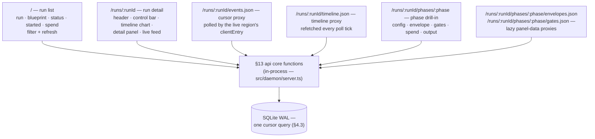
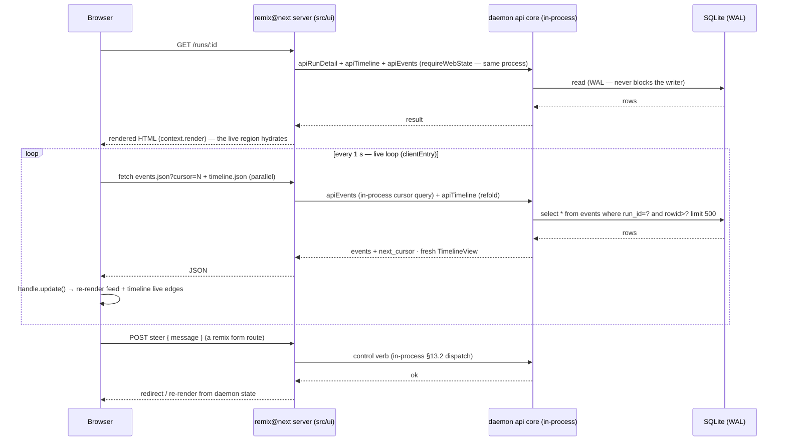

# Showrunner — Specification · UI — the remix@next dashboard

> Part of the [Showrunner specification](README.md) — section §16.
> **⚠️ NOT a React project** — see §16.1; read the mandatory guide list in §16.2 before touching `src/ui`.
> [index](README.md) · [01-overview](01-overview.md) · [02-core](02-core-sdk.md) · [03-data](03-data-and-events.md) · [04-daemon](04-daemon.md) · [05-ui](05-ui-dashboard.md) · [06-starter](06-starter-kit.md) · [07-tests](07-testing-and-rollout.md) · [08-verify](08-verification-record.md)

## 16 · UI (remix@next) — the dashboard

### 16.1 NOT a React project

The dashboard is built on **`remix@next`** (the `remix` package, v3 — `next` dist-tag): a ground-up, full-stack TypeScript framework that **does not use React at all**. This is a settled decision, not an open question, and it is stated this strongly because past agents repeatedly assumed React and produced wrong code. Everything in §16 assumes remix@next's model — if you find yourself writing React, you are wrong:

- **No React runtime** — `remix` is the *only* runtime dependency in `package.json`; there is no `react`/`react-dom` anywhere (verified against the official start-here guide).
- **No react-router** — routing is `remix/routes` typed route maps.
- **No React component idioms** — components use a different model: a function that receives a `handle` and returns another function that renders JSX (setup phase runs once; the returned render function runs on every update). State is a plain variable in the setup scope; updates via `handle.update()`.
- **Nothing from the React ecosystem belongs here**: no components library, no hooks, no context API, no `useEffect`, no JSX-the-React-way, no styling library — the `remix` package ships its own equivalents (§16.3).
- React Router v7 (framework mode) is **explicitly not** the target; that path serves Remix-v2-style apps and is not this project.

Why the React-free choice matters for Showrunner:

- The Reusable tenet ("no part of the system is locked into another") is violated by dragging a React runtime into the dashboard; remix@next has none by construction.
- "Agent-First Development" is one of remix@next's six core principles — it optimizes source, docs, tooling, and abstractions for LLM agents, which is Showrunner's own audience (and consistent with the agentic-engineering ethos the whole project is built around).
- "Religiously Runtime" + bundlerless, source-served assets: the UI is ordinary typed code that agents and humans read and edit — the replace-this doctrine applies to the dashboard too.
- Web APIs (`Request`/`Response`/`FormData`) as the seam with the daemon: the same portability story as the framework-agnostic core.

### 16.2 You MUST read the remix@next docs first

Before writing or reviewing any `src/ui` code, read the official guides at **https://guides.remix.run** — they are the primary source for everything in §16.3 onward and are structured for exactly this kind of agent-led work. Read the whole path once, then re-read the chapter relevant to the task at hand:

1. **start-here** — the tour: single-package app, route map, controller, render, hydration
2. **request-handling** — runtime adapters, `createRequestListener`, middleware ordering, typed request context
3. **routing-and-controllers** — route maps, route builders, controllers
4. **rendering-ui** — the two-phase component model
5. **streaming-ui-with-frames** — the render middleware behind `context.render(...)`
6. **data-and-validation** — `remix/data-schema`
7. **files-and-assets** — bundlerless asset serving, `clientEntry`, colocated `public/`
8. **interactivity** — client entries, events, progressive enhancement

Do not implement §16.3 onward from memory of Remix v2 or from this document alone — verify against the guides. (The §16 facts in this spec were checked against `/start-here`.)

### 16.3 What remix@next provides — the entire web stack

remix@next is not "React plus libraries"; for this app it *is* the whole web side. "For most web apps, `remix` can be the only runtime dependency in `package.json`" (official guide). It provides:

- **Typed routing and middleware** — `remix/routes` (route maps, `get`/`form` helpers, typed `href` builders), `remix/router` (`createRouter`), `remix/middleware/*` (static, form-data, render, …)
- **UI component model with server rendering and browser hydration** — `remix/ui` (`Handle`, `clientEntry`), `context.render()`; components render server-side and stream as HTML, then hydrate on demand
- **Navigation and forms** — typed links, redirects, and form `GET`/`POST` routes derived from the route map
- **Styling and event primitives** — `css()`/`mix` props and `on(...)` listeners — no styling library or event system to add
- **Data validation and persistence** — `remix/data-schema` (+ `form-data`, `coerce` subpaths): the framework's own validator
- **Authentication and sessions** (available if ever needed)
- **Asset serving** — bundlerless: browser modules are served as source from colocated `public/` directories via `import.meta.url`
- **Testing** — framework-provided test surface

Consequence for this project: `src/ui`'s dependency list is essentially just `remix` plus the daemon's §13 api core (called in-process — not a network client). There is no router choice, no UI-library choice, no styling choice, no form/validation-library choice to make — the framework owns all of it, which is exactly what the Reusable tenet wants.

### 16.4 Information architecture

The dashboard is four pages plus three JSON proxy routes and four control POST routes. Every page renders server-side and talks to the daemon **server-side**; the browser only ever sees HTML and polls the proxies (§16.5). The daemon serves the §13 JSON API under `/api/*` and the dashboard on ONE TCP listener (§13); the UI's server-side actions call the §13 api core **in-process** via `requireWebState()`.



| page | route | renders | data source (§13 api core, in-process) |
|---|---|---|---|
| Run list | `/` | table of runs | `apiListRuns` (`/api/runs`) |
| Run detail | `/runs/:runId` | header + control bar + timeline chart + detail panel + live feed | `apiRunDetail` + `apiTimeline` + `apiEvents` (`/api/runs/:id` + `/timeline` + `/events?cursor=`, polled) |
| Events proxy | `/runs/:runId/events.json` | JSON for the live region's clientEntry | `apiEvents` — a direct **in-process** call, no HTTP round trip |
| Timeline proxy | `/runs/:runId/timeline.json` | JSON of the R3 timeline view, refetched each poll tick | `apiTimeline` — same in-process call |
| Phase drill-in | `/runs/:id/phases/:phase` | config, envelope, gates, spend, output | `apiPhaseEnvelopes`, `apiPhaseGates`, `apiSpend`, `apiRaw` (+ the §13.3 blueprint snapshot file) |
| Panel-data proxies | `.../phases/:phase/envelopes.json` · `.../gates.json` | lazily fetched panel data for a selected phase | `apiPhaseEnvelopes` / `apiPhaseGates`, in-process |

### 16.5 Data flow & live updates

Two flows: page load (server-side) and the live loop (hydrated clientEntry polling the proxies). No WebSocket, no ingest path — the one cursor query (§4.3) is the only read transport, exactly as §2.3 mandates. The dashboard's server-side actions call the daemon's §13 api core functions **in-process** (`app/lib/daemon.ts` → `requireWebState()` → `src/daemon/server.ts`) — the same process, no socket round trip, no `DaemonClient` in the UI.



- Poll cadence: 1 s per open run detail page. The live region keeps `next_cursor` in setup scope and passes it back — same query, sliding window, zero server state.
- Each tick refetches `timeline.json` in parallel with `events.json`: open bubbles extend toward now, new segments appear between refreshes, row order stays fixed (blueprint order is server-side).
- A transient proxy failure keeps the last snapshot and retries next tick; a 404 on either proxy means the run is gone and stops the poll.
- Terminal transition: a run that completes while the page is open freezes the timeline (right edge = the `run_status` moment, now-cursor disappears) and stops the poll — a terminal run emits no more events. `interrupted` is NOT terminal (the run awaits a human resume), so the poll keeps running; open segments render with the interrupted outcome.
- After any control action (§16.9) the poll resumes automatically from the same sliding window. The UI never optimistically mutates run state.
- SSE over the same proxy remains the escape hatch if 1 s polling ever feels laggy — still no new transport.

### 16.6 Run list page (`/`)

```
┌────────────────────────────────────────────────────────────────┐
│ Showrunner  ·  runs                    [refresh]  status: all ▾ │
├────────────────────────────────────────────────────────────────┤
│  RUN        BLUEPRINT     STATUS        STARTED      SPEND     │
│  a1f2f3     plan_build    ▶ running     14:02:11     $0.42     │
│  b3c4d5     build_test    ⏸ paused      13:58:20     $1.10     │
│  c5d6e7     everything    ✓ success     13:41:09     $3.82     │
│  d7e8f9     prompt        ✗ failed      13:12:44     $0.31     │
│  e9f0a1     scout         ⚠ interrupted 12:50:03     $0.08     │
│  f1a2b3     plan_build    ⏳ queued (2)  12:41:55     -         │
└────────────────────────────────────────────────────────────────┘
```

- Rows link to run detail. Status uses the shared `StatusPill` (§16.10): running = animated pulse, paused = amber, success = green, failed = red, interrupted = grey ⚠, queued = dim with queue position (a pool-queued run's row is `running` until the pool starts it — the UI renders it "queued" from `queue_position`, §5.4/F2).
- Sort: started desc. Filter: by status (v1) — the `RunFilterForm` clientEntry (a `?status=` query round trip; no daemon call from the browser). `refresh` re-fetches `GET /runs` server-side.
- Empty state (§16.10): "no runs yet — `showrunner run <blueprint>`".

### 16.7 Run detail page (`/runs/:runId`) — timeline chart + detail panel + live feed

```
┌──────────────────────────────────────────────────────────────────┐
│ ‹ runs   plan_build · a1f2f3            ▶ running      [fail]    │
│ cwd ~/src/tiny-repo · started 14:02:11 · spend $0.42            │
├──────────────────────────────────────────────────────────────────┤
│  PHASE    AGENT      ▸ per-visit segments (bubbles) on the run   │
│                     time axis, oldest → now                      │
│  plan     planner    ██▌       14:02  14:08  14:14  now ▶        │
│  build    builder    ████████▌    v1    v2 ⚠ corr               │
│                      └─ revisit arrow (on_fail) ──────────┐      │
│  review   reviewer      ┌──── v1 (from build v2) ██▌       │     │
│  ship     ship       ░░ pending                              │    │
│                     ↑ now (vertical cursor)                   │    │
├──────────────────────────────────────────────────────────────────┤
│ DETAIL PANEL — build · visit 2 of 2 · on_fail (from build v1)    │
│   envelope · gates (override badges) · sessions (collapsible)    │
├──────────────────────────────────────────────────────────────────┤
│  LIVE FEED                                      [auto-scroll ●]  │
│  ▶ tool  14:10:22  bash: npm test -- --run          ✓  4.2s      │
│  ▶ turn  14:10:18  assistant: running the test suite             │
│  ⚠ corr  14:10:15  "tests failed: expected 3, got 2 — fix t1"   │
│  ✗ gate  14:09:38  lintClean · violations: 1                     │
│  ▶ tool  14:09:30  bash: ls -la src                 ✓  0.1s     │
└──────────────────────────────────────────────────────────────────┘
```

**Header**: breadcrumb to the run list, blueprint name, run id, `StatusPill`. **Control bar**: status, cwd, started/ended, total spend, `needs_review` badge (amber ⚠ if set — §16.10), and `resume` as a HEADER action for `interrupted` runs only (never part of the pause menu, §16.9). When the run is `paused`, the control bar also mounts the pause menu (§16.9).

**Timeline chart** (the `Timeline` component + `TimelinePanel`):

- One row per phase, in blueprint order (server-side — the R3 timeline view, §13.1). Each visit renders as a **segment bubble** on the run's time axis, colored by outcome; open segments grow toward now each poll tick.
- A vertical **now** cursor sits at the current run-relative time while the run runs; the x-axis ticks adapt to the run duration (seconds for short runs, hours for long).
- **Revisit arrows** connect an `on_fail` jump: from the END of the causing segment to the START of the target visit's segment (R3 cause provenance).
- Correction marks (a `✖n` on the bubble) and envelope-attempt counts per visit.
- Paused runs: the current (active) bubble gets a striped treatment; the pause reason is surfaced in the panel header from the `run_status → paused` event the poll already receives.
- Selection: the `?phase=` deep link (validated, unknown names fall back to auto-select — never crash), or auto-select (the phase currently in_progress, else the last phase with any segment). Bubble/row clicks update the selection AND the browser URL (`history.replaceState` with the same `?phase=` query) so the selection is always deep-linkable.

**Detail panel** (right/below the chart): the selected phase's visit history (newest first), each visit with its **cause banner** — `on_fail` (links to the causing phase's visit), `human` (which verb redrove it), or "reason not recorded" for pre-revisit-cause runs — plus the accepted envelope (summary, handoff, artifact existence, FINDINGS.md), gates with override badges, and the phase's agent sessions (collapsible). The panel's envelopes/gates are fetched **lazily on selection** through the `.json` proxies; the initial selection's data is server-rendered and seeds the cache.

**Live feed** (the `EventFeed` component):

- Renders folded daemon events (types 1–12, §6) newest-last; each row is typed by the `EventRow` component (§16.10): tool calls as `bash: npm test` with expandable args + result snippet, turns as assistant messages, corrections ⚠ with the message, gate results ✗/✓ with violations, `human_action` (steer/override/…) with a distinct marker, spend deltas.
- Auto-scroll to newest by default; pause on hover; toggleable.
- This is the "as though we were viewing it in the TUI" surface — the observable tenet made literal.

### 16.8 Phase drill-in page (`/runs/:id/phases/:phase`)

Stacked cards (tabs deferred — v1 keeps it linear):

```
┌────────────────────────────────────────────────────────────────┐
│ ‹ runs › plan_build › build        build · visit 1 · corr 2    │
├────────────────────────────────────────────────────────────────┤
│ CONFIG — agent: builder · model: deepseek-v4-pro               │
│   tools: bash, edit, read, grep, find, poll                    │
│   context: README.md (inlined) · "demo repo rules"            │
│   prompt: [pre block — from the blueprint snapshot §13.3]      │
│                                                                │
│ ENVELOPE — accepted 14:10:41 (attempt 2 of 3)                  │
│   attempts: 1 ✗ invalid (envelope.json missing) → corrected    │
│             2 ✓ valid, gates passed                            │
│   summary · notes_for_next_agent · artifacts (+ existence)     │
│   FINDINGS.md (collapsible, when the phase wrote one)          │
│                                                                │
│ GATES — testsPass ✓ · lintClean ✗ (1 violation)                │
│   [override badge: reason + who — audited, §13.2]              │
│                                                                │
│ SPEND — tokens in 12,480 · out 3,210 · cache r/w 0/0 · $0.30   │
│   (estimated flagged when the roster filled gaps; a truncated  │
│   marker when the spend sweep hit its safety cap)              │
│                                                                │
│ OUTPUT — raw feed tail (raw_output.jsonl)                    │
└────────────────────────────────────────────────────────────────┘
```

- **Config**: from the run's blueprint snapshot (§13.3), not the live blueprint — what actually ran.
- **Envelope**: accepted envelope + full attempt history (each attempt: valid/invalid, the violations that rejected it, and the correction message that followed), artifact existence checked against the phase's `outputs/` dir, and FINDINGS.md content when the agent wrote one (the conventional "what I learned" file agents leave in outputs).
- **Gates**: per gate — pass/fail, violations list, `overridden` badge with reason + who (the audit trail is the point, §13.2). Read-only here: the override *control* lives on the run-detail pause menu (§16.9).
- **Spend**: per-phase tokens (in/out/cache) and USD from `spend` events, with an `estimated` flag when the price roster filled gaps and a truncated marker when the sweep hit its cap.
- **Output**: tail of `raw_output.jsonl` (the record of truth, §10), rendered verbatim — the drill-in's "TUI-like" view.
- Missing run OR missing phase → 404 with a back-link (§16.10).

### 16.9 Pause menu & control verbs

A menu rendered by run detail when the run is `paused`. Which actions render comes from the daemon's own pause viewer (§13 `GET /runs/:id/pause`): the `actions` array is the effective menu per pause kind — `approval` → approve+steer+fail, `budget_exhausted` → steer+restart+fail (+override when a gate was rejected), `guard_exhausted` → steer+fail, `blocked` → steer+fail, `hook_failed` → restart+fail. A paused run whose daemon handle was lost to a restart answers with no actions (viewer-only, §13).

```
┌────────────────────────────────────────────────┐
│ ⏸ Paused — build (correction budget 2/3)      │
│                                                │
│  steer  ┌──────────────────────────────┐       │
│         │ fix the failing test, then   │       │
│         │ re-run the suite             │       │
│         └──────────────────────────────┘       │
│         [send]  → POST /runs/:id/steer         │
│                                                │
│  override gate   lintClean ▾   reason…   [go]  │
│  restart phase fresh   (new session, confirm)  │
│  fail run              (confirm)               │
│  approve               (only for approval pauses)
└────────────────────────────────────────────────┘
```

- Every action is a server-rendered **form** posting to a remix POST route (`/runs/:id/steer|resume|fail|approve`, `/runs/:id/phases/:phase/override|restart-fresh`) that dispatches to the §13.2 daemon endpoint in-process (§16.4). The browser never POSTs to the daemon directly.
- Client-submitted values (steer text, override reason) are validated with `remix/data-schema` — the UI does not import zod; `core`'s one-validation story is untouched. A validation failure or a daemon 409/4xx re-renders the page with the error on the form that submitted it.
- `steer` and `override` are the audited human interventions — each writes a `human_action` event with the reason (§6 #11). Override keeps the original `gate_results` row and adds the audited marker (§4.2 v2).
- `resume` (interrupted runs) is a separate header action, not part of this menu (§16.7).
- After any action the poll loop resumes automatically; the UI never optimistically mutates run state.

### 16.10 Shared components, states, errors

**Components** (`app/ui/`):

- `StatusPill({status})` — the status→color/glyph map (16.6), with optional queue position.
- `Timeline` / `TimelinePanel` (`app/ui/public/`) — the run-detail chart + detail panel (16.7); layout math lives in `timeline-model.ts` (pure, DOM-free, unit-tested).
- `EventFeed` / `EventRow` (`app/ui/public/event-feed.tsx`) — typed rendering per event type 1–12; tool-call rows expandable (args + result snippet); names read aloud like `bash: ls -la src`.
- `PauseMenu` (`app/ui/pause-menu.tsx`) + the control forms (16.9).
- `NeedsReviewBanner`, `EmptyState`.
- Formatting helpers: `app/ui/format.ts` (server-only pages) and `app/ui/public/format.ts` (local copies for the browser module graph — the asset boundary means browser modules cannot import `app/ui/format.ts`): `fmtDuration`, `fmtMoney` (USD), `fmtTokens`, `fmtRunId` (short id).

**Daemon data layer** (`app/lib/daemon.ts`, server-side only): one function per §13 read/verb. Every call resolves the daemon's live state via `requireWebState()` (`src/daemon/web-state.ts`) and dispatches straight to the §13 api core in `src/daemon/server.ts` — **in-process**, the same process as the daemon's web server, no socket round trip, no HTTP hop, no `DaemonClient` in the UI.

**States:**

- **Empty** — no runs: one-line CTA `showrunner run <blueprint>`.
- **`needs_review`** — amber banner on run detail and drill-in: "resumed after an interruption — the transcript may be incomplete; review before trusting" (§12).
- **Missing run/phase** — 404 with back-link, matching §13.3 snapshot semantics (blueprint edits don't change past runs).

There is no daemon-unreachable state: the UI runs inside the daemon, so if a page renders, the daemon is up by construction.

### 16.11 Requirements summary (unchanged)

- **Run list** — every run, status pill, spend, queue position. `/`
- **Run detail** — timeline chart (per-phase rows, per-visit segments, duration, corrections/visits, revisit arrows, spend) + detail panel + live feed. `/runs/:id`
- **Phase drill-in** — agent config, prompt, token usage, envelope, gate results, simplified output feed. `/runs/:id/phases/:phase`
- **Controls** — pause menu (steer / override / restart / fail), approve, resume interrupted. Read-only otherwise.

### 16.12 Framework conventions recap

- `app/routes.ts` — the typed route map (the URL contract shared by server actions and browser modules): `/`, `/runs/:runId`, `/runs/:runId/events.json`, `/runs/:runId/timeline.json`, POST `/runs/:runId/{steer,resume,fail,approve}`, `/runs/:runId/phases/:phase`, `/runs/:runId/phases/:phase/{envelopes,gates}.json`, POST `/runs/:runId/phases/:phase/{override,restart-fresh}`, and the colocated asset server `/assets/*path`. Typed hrefs are generated from the map.
- `app/actions/*/controller.tsx` — a controller per route group; actions read `context.params` / parsed `formData` and return Web `Response`s — HTML via `context.render(<Page/>)`, or JSON for the proxies.
- `app/middleware/` — render + form-data middleware; `server.ts` — Node entry via `createRequestListener` (`remix/node-fetch-server`).
- **The daemon API is called server-side only** — no CORS, no daemon credentials in the browser; the browser sees rendered HTML and the JSON proxies.
- **Validation** of client-submitted values (steer text, override reason) uses `remix/data-schema` — the UI does not import zod; `core`'s one-validation story is untouched.
- Assets are bundlerless source modules served from colocated `public/` directories; dev server on port 44100. `remix` is pinned **exactly** (`3.0.0-beta.10` in the root `package.json`) — do not float it: `next` is a rolling dist-tag and the §16 contract tracks this version.
